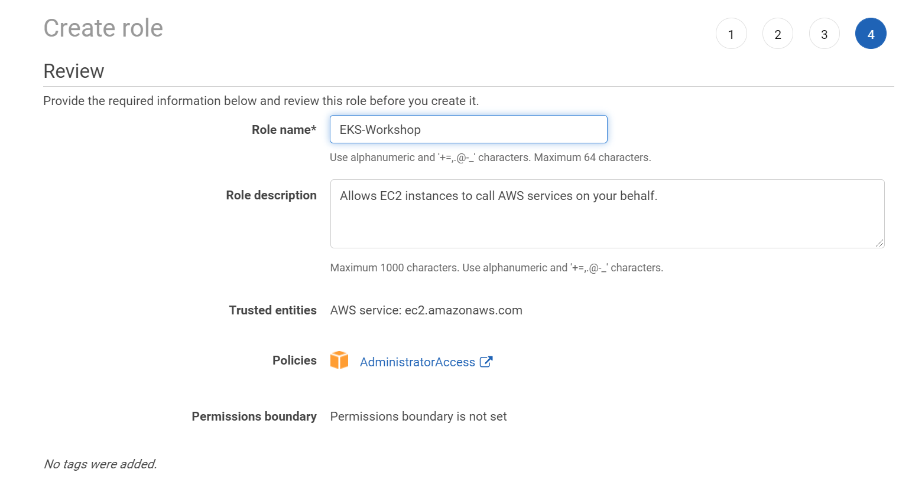

# Project Setup - Lab 0

Prepare your workspace to interact with AWS EKS by installing the required utilities. This configuration assumes you're using AWS Cloud9.

## Deployment

Execute the [setup.sh](./setup.sh) script on your workspace:

```bash
chmod +x ./setup.sh
```

```bash
./setup.sh
```

The [setup.sh](./setup.sh) script accomplishes the following:

```bash
echo "Setup SSH Key ..." && sleep 1
ssh-keygen -N ""
aws ec2 import-key-pair --key-name "eks-workshop" --public-key-material file://~/.ssh/id_rsa.pub
printf "\n"

echo "Install Dependencies ..." && sleep 1
sudo yum update -y
sudo yum install -y jq gettext bash-completion moreutils
printf "\n"

echo "Set AWS Environment Variables ..." && sleep 1
export ACCOUNT_ID=$(aws sts get-caller-identity --output text --query Account) 
export AWS_REGION=$(curl -s 169.254.169.254/latest/dynamic/instance-identity/document | jq -r '.region') 
echo "export ACCOUNT_ID=${ACCOUNT_ID}" >> ~/.bash_profile 
echo "export AWS_REGION=${AWS_REGION}" >> ~/.bash_profile 
aws configure set default.region ${AWS_REGION} 
aws configure get default.region
printf "\n"

echo "Prepare for EC2 Role ..." && sleep 1
rm -vf ${HOME}/.aws/credentials
```

Attach EC2 Role to Cloud9 Workspace:

1. Disable Cloud9 Temporary Credentials 

2. Create EC2 Role 

3. Attach EC2 Role to Cloud9 
