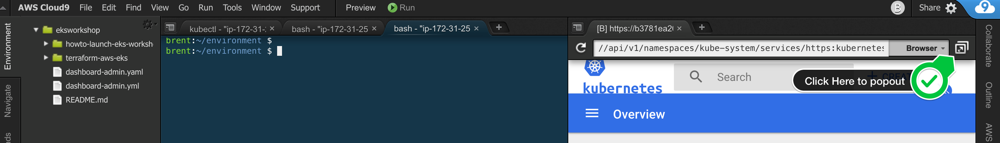
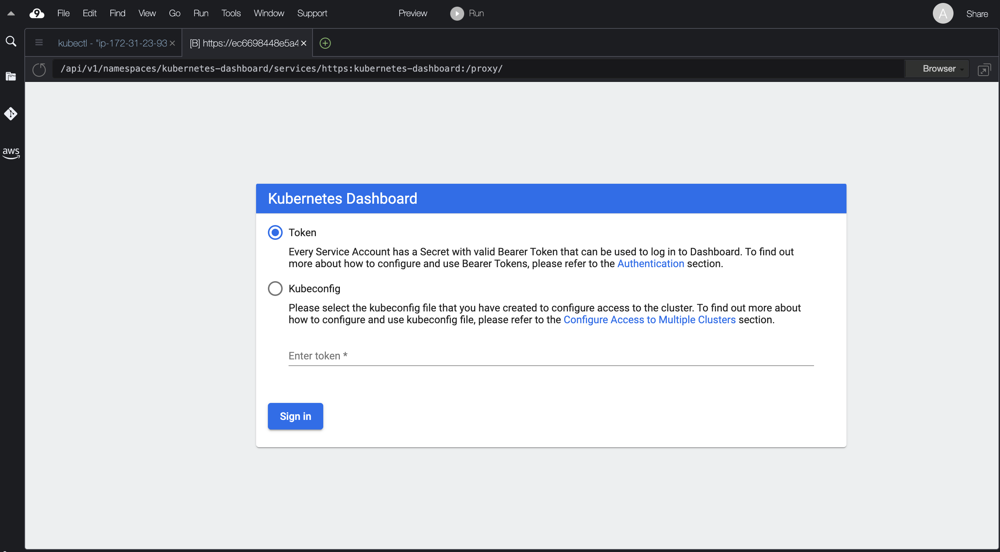
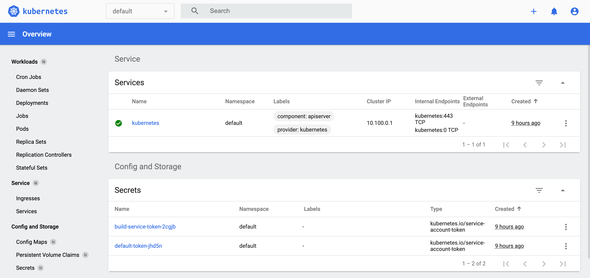

# Preparing EKS Cluser for Applications - Lab 2

* Verify AWS Load Balancer IAM roles for service account is configured
* Deploy AWS Load Balancer Controller for external connectivity
* Deploy official Kubernetes dashboard

## Preparation

Execute the [prepare-cluster.sh](./prepare-cluster.sh) script in your workspace:

```bash
chmod +x ./prepare-cluster.sh
```

```bash
./prepare-cluster.sh
```

```bash
kubectl logs -n kube-system deployments/aws-load-balancer-controller
```

```bash
kubectl -n kube-system get deployments
```

The [prepare-cluster.sh](./prepare-cluster.sh) script accomplishes the following:

```bash
CLUSTER_NAME="airports"

echo "Install AWS Load Balancer Controller ..." && sleep 1
kubectl apply -k "github.com/aws/eks-charts/stable/aws-load-balancer-controller/crds?ref=master"
helm repo add eks https://aws.github.io/eks-charts
helm upgrade -i aws-load-balancer-controller eks/aws-load-balancer-controller \
  -n kube-system \
  --set clusterName=${CLUSTER_NAME} \
  --set serviceAccount.create=false \
  --set serviceAccount.name=aws-load-balancer-controller \
printf "\n"

echo "Deploy Kubernetes Dashboard ..." && sleep 1
export DASHBOARD_VERSION="v2.0.5"
kubectl apply -f https://raw.githubusercontent.com/kubernetes/dashboard/${DASHBOARD_VERSION}/aio/deploy/recommended.yaml
```

## View Kubernetes Metrics Dashboard

Establish proxy request to dashboard:

```bash
kubectl proxy --port=8080 --address=0.0.0.0 --disable-filter=true &
```

In your Cloud9 workspace, click **Tools / Preview / Preview Running Application**

Append the following to URL:

```text
/api/v1/namespaces/kubernetes-dashboard/services/https:kubernetes-dashboard:/proxy/
```

Pop Out screen larger for access:





In a new terminal in Cloud9 workspace, request a token for dashboard and input into Dashboard:

```bash
aws eks get-token --cluster-name airports | jq -r '.status.token'
```

View Kubernetes Dashboard:


