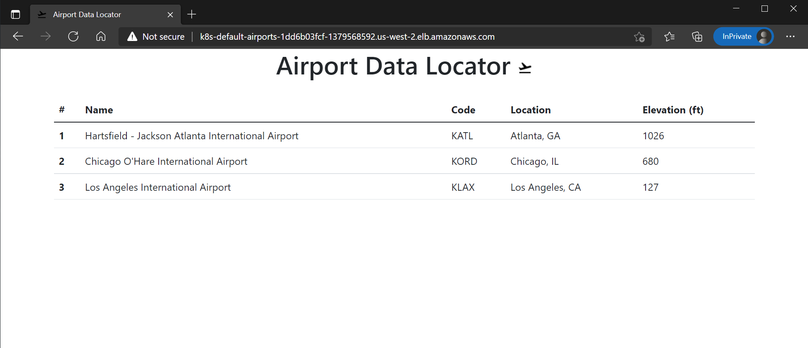

# Deploying Application to EKS Cluster - Lab 4

This lab deploys the containerized application from ECR into the newly formed EKS cluster. This lab contains the following templates:

1. [airports-deployment.yaml](./1-airports-deployment.yaml)
2. [airports-service.yaml](./2-airports-service.yaml)
3. [airports-ingress.yaml](./3-airports-ingress.yaml)

## Deployment

1. Verify you're in the correct working directory of Lab 4:

    ```text
    PROJECT_ROOT/4-deploying-application-into-eks/
    ```

2. Get Elastic Container Repository image to add to Kubernetes deployment in Step 3. Save output for next step:

    ```bash
    echo "${ECR_REPOSITORY_URI}:1.0.0"
    ```

3. Add the Elastic Container Repository image from Step 2 to the image field location (REPLACE_ME) in [airports-deployment.yaml](./1-airports-deployment.yaml) in text editor:

    ```yaml
    apiVersion: apps/v1
    kind: Deployment
    metadata:
      name: airports-data
    spec:
      replicas: 3
      selector:
        matchLabels:
          app: airports-data
      template:
        metadata:
          labels:
            app: airports-data
        spec:
          containers:
            - name: airports-data
              image: ******REPLACE_ME*******
              imagePullPolicy: Always
              ports:
                - containerPort: 8080
                  protocol: TCP
              resources:
                requests:
                  memory: "512Mi"
                  cpu: "250m"
                limits:
                  memory: "1Gi"
                  cpu: "1000m"
    ```

4. Deploy [airports-deployment.yaml](./1-airports-deployment.yaml) deployment to EKS Cluster:

    ```bash
    kubectl apply -f 1-airports-deployment.yaml
    ```

5. Validate deployment is healthy by viewing a total of 3 airport-data-* in Running status:

    ```bash
    kubectl get deployments.apps
    ```

6. Deploy [airports-service.yaml](./2-airports-service.yaml) service to EKS Cluster:

    ```bash
    kubectl apply -f 2-airports-service.yaml
    ```

7. Deploy [airports-ingress.yaml](./3-airports-ingress.yaml) Ingress to allow external connectivity to your newly deployed service in the EKS Cluster:

    ```bash
    kubectl apply -f 3-airports-ingress.yaml
    ```

8. Visit AWS Console and copy URL automatically generated by application load balancer into new browser tab:

   ```text
   http://XXXXXXX.region.elb.amazonaws.com/
   ```

   
