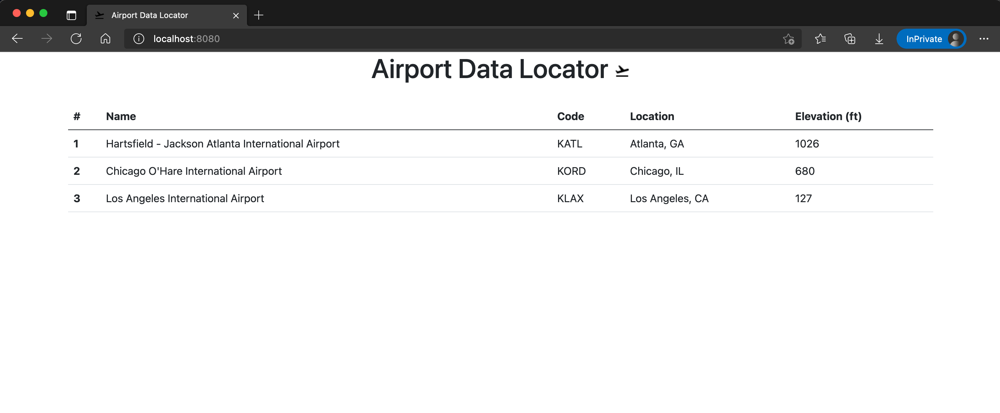

# AWS Elastic Kubernetes Service (EKS) Workshop

This workshop is designed to help users learn Kubernetes on AWS using EKS. To start, download the project to a working directory on [AWS Cloud9 Workspace](https://console.aws.amazon.com/cloud9/home/product?p=c9&cp=bn&ad=c):

```bash
git clone https://github.com/ig33kmor3/aws-eks-workshop.git
```

This gives users the ability to utilize some of the scripts locally and save time creating files from scratch. Each directory is an individual lab.

## [Project Setup - Lab 0](./0-setup)

Prepare your Cloud9 Workspace to interact with AWS EKS by installing the required utilities.

## [Launching an EKS Cluster - Lab 1](./1-launching-eks-cluster)

Deploy an EKS cluster using [eksctl](https://eksctl.io/).

## [Preparing EKS Cluster for Applications - Lab 2](./2-preparing-eks-cluster )

Execute the following:

* Verify AWS Load Balancer IAM roles for service account is configured
* Deploy AWS Load Balancer Controller for external connectivity
* Deploy official Kubernetes dashboard

## [Containerize Tomcat Web Application - Lab 3](./3-containerize-web-application)

Securely containerize a Java Spring Boot MVC application with Tomcat Servlet for deployment into the cluster. Push containerized application to AWS Elastic Container Registry (ECR).



## [Deploying Application to EKS Cluster - Lab 4](./4-deploying-application-into-eks)

Deploy the above containerized application from ECR into the newly formed EKS cluster.

## [Update Deployment on EKS Cluster - Lab 5](./5-update-application-deployment)

Update the containerized application by adding additional airports then containerizes a new version for upload to ECR.
